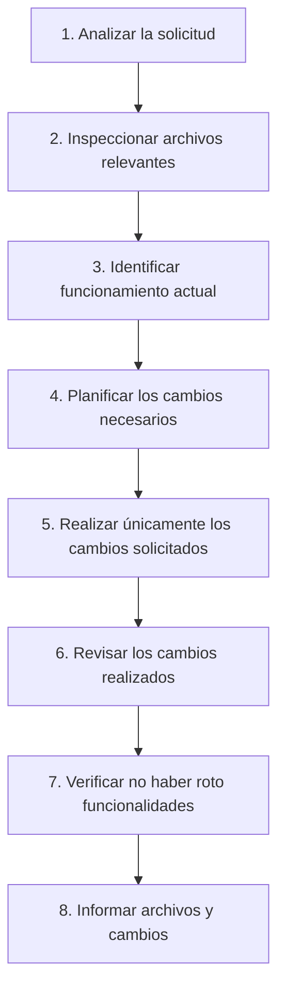

# Guía de Instrucciones y Reglas para Agentes de IA — Hermanos Jota

Este documento establece las directrices, restricciones técnicas y flujos de trabajo obligatorios para cualquier agente de IA o desarrollador que trabaje en este repositorio.

---

## 1. Descripción del Proyecto

**Hermanos Jota** es un e-commerce frontend desarrollado como proyecto académico colaborativo (equipo de 4 integrantes). Es un sitio web de catálogo y venta simulada de muebles artesanales y de diseño con identidad argentina.

El proyecto opera **100% en el frontend sin backend ni base de datos externa**. Las simulaciones de datos se resuelven mediante estructuras nativas en JavaScript (`Array` de objetos en memoria) y persistencia en el cliente a través de `localStorage`.

---

## 2. Tecnologías Utilizadas y Permitidas

### Tecnologías en uso (Estrictamente permitidas)
- **HTML5 semántico**
- **CSS3 Vanilla** (con variables CSS / Custom Properties, Flexbox, CSS Grid y Media Queries)
- **JavaScript Moderno (ES6+) Vanilla** (sin frameworks ni transpiladores)
- **Google Fonts** (Inter y Playfair Display)
- **SVG / PNG locales** para recursos gráficos

### Tecnologías y herramientas PROHIBIDAS
- ❌ **NO frameworks ni librerías JS**: Prohibido instalar o importar React, Vue, Angular, Svelte, jQuery, Alpine.js, etc.
- ❌ **NO frameworks ni preprocesadores CSS**: Prohibido TailwindCSS, Bootstrap, Bulma, Sass, Less, Stylus, PostCSS.
- ❌ **NO gestores de paquetes ni bundlers**: Prohibido inicializar `npm`, `yarn`, `pnpm`, `webpack`, `vite`, `parcel`, etc., salvo instrucción explícita del usuario.
- ❌ **NO librerías de componentes o utilitarios externos**: Prohibido Lodash, Axios, Moment.js, etc. Todo debe resolverse con APIs web estándar nativas (`fetch`, `URLSearchParams`, `Intl`, `localStorage`, etc.).

---

## 3. Estructura del Proyecto y Archivos Principales

```text
MuebleriaJota/
├── index.html          # Portada / Home: hero, piezas destacadas (#featured-products), valores de marca
├── productos.html      # Catálogo general: barra de búsqueda (#search) y grilla de productos (#product-grid)
├── producto.html       # Vista de detalle individual (#product-detail) alimentada por URL param (?id=X)
├── contacto.html       # Formulario de contacto con validación HTML5 (#contact-form, #form-message)
├── README.md           # Documentación académica del proyecto
├── AGENTS.md           # Instrucciones y reglas para agentes de IA (este archivo)
├── css/
│   └── style.css       # Hoja de estilos global única (variables, layout, componentes, media queries)
├── js/
│   ├── productos.js    # Fuente de datos de productos (array global `productos`)
│   └── app.js          # Lógica de renderizado, búsqueda, carrito, detalle y formulario
└── img/                # Fotografías de productos (PNG) e isotipos/logos (SVG)
```

### Relación y orden de carga de scripts
En todos los archivos HTML, los scripts deben mantenerse al final del `<body>` en este orden estricto:
```html
<script src="js/productos.js"></script>
<script src="js/app.js"></script>
```
`app.js` depende de la variable global `productos` declarada en `productos.js`.

---

## 4. Reglas Generales para Modificar el Código

1. **Reutilizar antes de crear**: Antes de añadir una función o clase CSS, verificar si ya existe en `app.js` o `style.css`.
2. **Alcance acotado**: Modificar únicamente los archivos estrictamente necesarios para cumplir el objetivo pedido.
3. **No reescribir archivos enteros**: Realizar ediciones quirúrgicas. Mantener la estructura, identación y comentarios preexistentes.
4. **No eliminar funcionalidades existentes**: A menos que se solicite explícitamente, no quitar características como el buscador, contador de carrito o renderizado asíncrono.
5. **No agregar código o dependencias no solicitadas**: No incorporar features especulativas ("por si acaso").
6. **Separación estricta de responsabilidades**:
   - Estructura y semántica en **HTML**.
   - Presentación y animaciones en **CSS**.
   - Comportamiento y lógica en **JavaScript**.
   - No usar estilos `inline` (`style="..."`) salvo casos dinámicos indispensables.
   - No usar manejadores de eventos en HTML (`onclick="..."`). Usar `addEventListener` en JS.

---

## 5. Reglas Específicas para HTML

1. **Semántica HTML5**: Utilizar etiquetas semánticas (`<header>`, `<nav>`, `<main>`, `<section>`, `<article>`, `<aside>`, `<footer>`).
2. **Jerarquía de Encabezados**: Mantener un único `<h1>` por página, seguido coherentemente por `<h2>` y `<h3>`.
3. **Imágenes accesibles**: Toda etiqueta `` debe contar con atributos `src` y `alt` descriptivos.
4. **Formularios**:
   - Cada `<input>` o `<textarea>` debe tener un `<label>` asociado mediante el atributo `for` coincidente con el `id`.
   - Utilizar validación nativa (`required`, `type="email"`, `minlength`, etc.).
5. **IDs de control existentes**: Respetar los IDs utilizados por JavaScript para no romper selectores:
   - `#cart-count`: Contador de ítems en la navegación.
   - `#featured-products`: Contenedor de destacados en `index.html`.
   - `#product-grid`: Contenedor del catálogo en `productos.html`.
   - `#search`: Input de búsqueda en `productos.html`.
   - `#product-detail`: Contenedor del detalle en `producto.html`.
   - `#contact-form`, `#form-message`: Formulario y mensaje de estado en `contacto.html`.

---

## 6. Reglas Específicas para CSS

1. **Uso de Variables CSS (`:root`)**: Usar siempre las variables definidas para colores y no hardcodear valores hexadecimales:
   - `var(--siena)` (#A0522D)
   - `var(--salvia)` (#87A96B)
   - `var(--alabastro)` (#F5E6D3)
   - `var(--oro)` (#D4A437)
   - `var(--rosa)` (#C47A6D)
   - `var(--texto)` (#2c2926)
   - `var(--blanco)` (#fffaf4)
2. **Centralización en `css/style.css`**: Todo estilo nuevo debe agregarse a este archivo en la sección correspondiente.
3. **Metodología de diseño**: Utilizar Flexbox y CSS Grid para diagramación.
4. **Nombres de clases consistentes**: Seguir la convención en minúsculas con guiones kebab-case (`.product-card`, `.detail-price`, `.btn-small`).
5. **Transiciones suaves**: Utilizar transiciones sutiles (`transition: transform .2s, opacity .2s`) manteniendo el estilo sobrio y elegante de la marca.

---

## 7. Reglas Específicas para JavaScript

1. **Modularidad y ámbito**: `productos.js` almacena los datos; `app.js` maneja la interactividad.
2. **Estructura del array de productos** en `js/productos.js`:
   Cada producto debe mantener la siguiente estructura:
   ```javascript
   {
     id: Number,           // Identificador numérico único
     nombre: String,       // Nombre de la pieza
     precio: Number,       // Valor numérico entero (en pesos ARS)
     categoria: String,    // Categoría ("Sillones", "Mesas", "Sillas", "Bibliotecas", etc.)
     imagen: String,       // Ruta relativa válida (ej: "img/Sillón Copacabana.png")
     descripcion: String,  // Descripción conceptual
     materiales: String,   // Especificación de materiales
     destacado: Boolean    // true para aparecer en la home (index.html)
   }
   ```
3. **Formateo de Moneda**: Utilizar la función `formatoPrecio(precio)` que implementa `Intl.NumberFormat("es-AR", { style: "currency", currency: "ARS", maximumFractionDigits: 0 })`.
4. **Asincronía simulada**: Mantener la función `cargarProductos()` que devuelve una `Promise` con `setTimeout` para simular latencia de red.
5. **Generación dinámica de HTML**: Al usar template literals para inyectar HTML, asegurar que todos los botones de acción incluyan sus atributos `data-*` correspondientes (ej. `data-id="${producto.id}"`).

---

## 8. Reglas de Responsive Design y Mobile First

1. **Filosofía Mobile First**: Los estilos base fuera de media queries corresponden a pantallas móviles / angostas.
2. **Breakpoints estándar**: Utilizar la media query establecida en el proyecto:
   ```css
   @media (min-width: 768px) {
     /* Reglas para tablets y escritorio */
   }
   ```
3. **Tipografía y Espaciado Fluido**: Emplear `clamp()` para tamaños de títulos (`clamp(2.5rem, 8vw, 5.5rem)`) y unidades relativas (`rem`, `%`, `vh`, `vw`).
4. **Grillas adaptables**: Mantener `grid-template-columns: repeat(auto-fit, minmax(220px, 1fr))` para grillas que fluyan naturalmente sin desbordar.

---

## 9. Reglas sobre `localStorage`, Carrito y Datos

1. **Clave de almacenamiento**: La clave utilizada en `localStorage` es estrictamente `"carritoHermanosJota"`.
2. **Formato de datos del carrito**: Array de IDs numéricos: `[1, 2, 4]`.
3. **Manejo defensivo**:
   - `obtenerCarrito()` siempre debe parsear con fallback: `JSON.parse(localStorage.getItem("carritoHermanosJota")) || []`.
   - Guardar con `localStorage.setItem("carritoHermanosJota", JSON.stringify(carrito))`.
4. **Sincronización del contador**: Cada vez que se agregue o modifique un elemento del carrito, se debe invocar `actualizarCarrito()` para reflejar el total en `#cart-count`.

---

## 10. Identidad Visual, Colores y Tipografías

El diseño respeta el **Manual de Marca de Hermanos Jota**:

### Paleta de Colores
| Nombre | Variable CSS | Código Hex | Uso principal |
|---|---|---|---|
| Siena Tostado | `--siena` | `#A0522D` | Botones principales, acentos, links destacados |
| Verde Salvia | `--salvia` | `#87A96B` | Sección de sustentabilidad, mensajes de éxito |
| Alabastro Cálido | `--alabastro` | `#F5E6D3` | Fondo principal (`body`), fondos de encabezados |
| Vara de Oro | `--oro` | `#D4A437` | Detalles secundarios |
| Rosa Polvoriento | `--rosa` | `#C47A6D` | Acentos cálidos |
| Texto Principal | `--texto` | `#2c2926` | Párrafos y tipografía general |
| Fondo Blanco Cálido | `--blanco` | `#fffaf4` | Tarjetas de producto, cajas de formulario |

### Tipografías
- **Títulos y encabezados (`h1`, `h2`, `h3`)**: `"Playfair Display", Georgia, serif`
- **Cuerpo, navegación, botones y datos**: `"Inter", sans-serif`

---

## 11. Accesibilidad (a11y) y Buenas Prácticas

1. **Contraste de Color**: Mantener combinaciones legibles que respeten las pautas WCAG AA.
2. **Navegación por teclado**: No eliminar ni alterar los outlines de `:focus` sin proveer un reemplazo accesible.
3. **Regiones activas (`aria-live`)**: Mantener atributos `aria-live="polite"` en mensajes dinámicos de formularios y confirmaciones (ej. `#form-message`, `#detail-message`).
4. **Etiquetas descriptivas**: Botones y links de íconos o logos deben tener `aria-label` descriptivo.

---

## 12. Reglas para Evitar Modificaciones Innecesarias

1. No refactorizar código que funciona correctamente a menos que se haya pedido expresamente.
2. No reordenar o cambiar la estructura de carpetas (`css/`, `js/`, `img/`).
3. No cambiar nombres de archivos existentes (`index.html`, `productos.html`, `producto.html`, `contacto.html`, `style.css`, `productos.js`, `app.js`).
4. No alterar el contenido del `README.md` a menos que sea una tarea específica sobre documentación.

---

## 13. Qué Hacer Antes de Modificar Código Existente

1. **Localizar el punto exacto**: Buscar qué función en `js/app.js` o qué selector en `css/style.css` gobierna la funcionalidad solicitada.
2. **Comprender dependencias**: Comprobar si la modificación afecta a más de una página (por ejemplo, cambios en la barra de navegación o el footer impactan en los 4 archivos HTML).
3. **Inspeccionar selectores DOM**: Verificar si el elemento HTML tiene listeners asociados antes de renombrar clases o IDs.

---

## 14. Qué Verificar Antes de Considerar una Tarea Terminada

- [ ] ¿La funcionalidad solicitada cumple al 100% con lo pedido sin agregar extras?
- [ ] ¿El catálogo en `index.html` (destacados) y `productos.html` (completo) se visualiza correctamente?
- [ ] ¿El detalle individual `producto.html?id=X` carga los datos del producto seleccionado?
- [ ] ¿La búsqueda de productos en `productos.html` filtra por nombre, categoría y descripción?
- [ ] ¿El contador del carrito se actualiza y persiste en `localStorage`?
- [ ] ¿El formulario en `contacto.html` valida los campos y muestra el mensaje de feedback?
- [ ] ¿El diseño se mantiene responsive en móvil (< 768px) y escritorio (≥ 768px)?
- [ ] ¿No se introdujeron errores ni advertencias en la consola del navegador?

---

## 15. Reglas para Evitar Romper Funcionalidades Existentes

1. **Preservar parámetros URL**: La página de detalle depende exclusivamente del query param `?id=N`. No cambiar este mecanismo.
2. **Preservar la firma de funciones compartidas**: Mantener nombres y argumentos de `obtenerCarrito()`, `agregarAlCarrito()`, `actualizarCarrito()`, `formatoPrecio()`.
3. **Evitar colisiones de eventos**: Asegurarse de que los event listeners no se vinculen de forma duplicada al re-renderizar grillas (utilizar atributos como `dataset.ready` cuando aplique).

---

## 16. Instrucciones sobre Cómo Informar los Cambios Realizados

Al terminar una tarea, el agente debe proporcionar un reporte conciso y estructurado que detalle:
1. **Archivos modificados**: Lista con rutas relativas de cada archivo intervenido.
2. **Resumen de cambios**: Explicación clara y puntual de qué se agregó, modificó o eliminó.
3. **Impacto en el sistema**: Breve confirmación de que las funcionalidades preexistentes siguen operativas.

---

## Workflow para Agentes

Todo agente de IA que opere en este repositorio debe seguir obligatoriamente este flujo de trabajo secuencial:



1. **Analizar la solicitud**: Comprender en detalle el requerimiento del usuario y definir su alcance exacto.
2. **Inspeccionar los archivos relevantes**: Leer el código fuente involucrado en `html/`, `css/` o `js/`.
3. **Identificar cómo funciona actualmente la funcionalidad**: Rastrear el flujo de datos y ejecución en el código real.
4. **Planificar los cambios necesarios**: Diseñar la solución respetando la arquitectura vanilla y las reglas del proyecto.
5. **Realizar únicamente los cambios relacionados con la tarea**: Ejecutar modificaciones puntuales y limpias sin tocar código no relacionado.
6. **Revisar los cambios realizados**: Asegurarse de que el código añadido sigue las convenciones de estilo y arquitectura.
7. **Verificar que no se hayan roto funcionalidades existentes**: Chequear la integridad de las 4 páginas, el carrito y la reactividad visual.
8. **Informar qué archivos fueron modificados y qué se cambió**: Presentar el resumen final al usuario de manera clara y estructurada.
